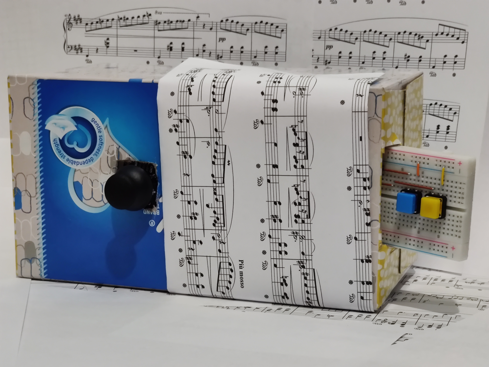
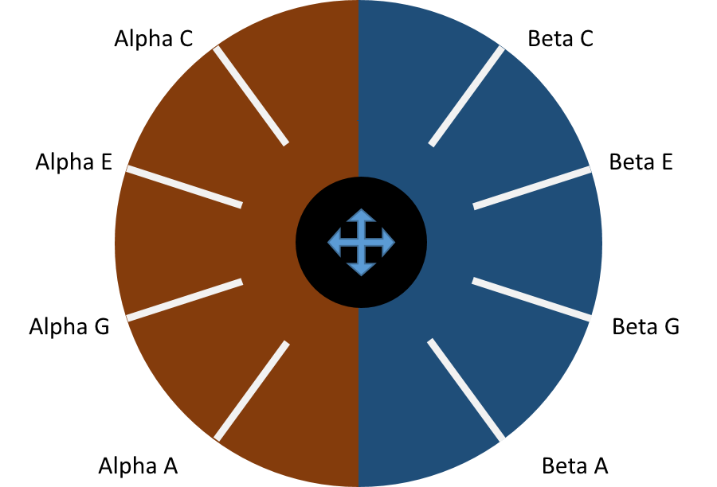

# InstruMini
## String instruments, modernized.

[Video Intro](https://youtu.be/IEushFeu8Uk)

Despite their high prices, there really hasn't been much innovation in the category of stringed instruments. The build quality might be better or faster, but it's still the same idea: strings and a fretboard.

The InstruMini aims to demonstrate a modernized interface which allows for increased information density, and thus communication of more through less.

The number of notes in linearly proportional to the number of frets on a stringed instrument. On some wind instruments such as trumpets, the relation is quadratic. However, consider that each fret when represented via an electronic interface is simply a bit. Thus, the power of expression should scale exponentially with the number of controls.

## TODO: Table of Contents

# How to Play the Instrument
The joystick takes the place of the strings on this instrument. Moving it towards the fretboard provides access to one set of notes, while moving it away provides access to another set of notes (as shown in the image below). Note that these two instruments are denoted as "Alpha" and "Beta". Initially, these map to a piano and a bitlead synth respectively.

When the joystick crosses one of the strings, the associated note is played. Pressing the upper button changes the note by one half step, and pressing the lower button changes the note by two half steps. Pressing both buttons changes the note by three half steps!

Pressing the joystick button (z-axis) toggles chord mode. In chord mode, the C-E-G-A strings instead become the chords of a I-VI-IV-V chord progression.

Flipping the switch changes the instrument into configuration mode. From here, the key can be changed (shifting all notes by the same amount, akin to a virtual capo) using the "Beta" instrument side as shown in the image above. Moving farther from Beta C represents a shift upwards along the scale. The "Alpha" instrument side can be used to change the instrument. The upper quadrant (with the C and E strings) selects the default piano and bitlead combo. The lower quadrant changes to another pair of instruments (subpulse and hoover synths).

## Visual Effects
A circular LED module hidden under the sheet music on the front face of the instrument will indicate the joystick position via a quadratic interpolation (making the output appear to match the position of the analog joystick despite occuring in eight discrete points). In addition, it will show the active instrument and provide visual feedback when in configuration mode. The inclusion of the visual component allows viewers in the audience to appreciate dynamically the movements of the performer.

# Setup
## Hardware
The device is composed of two main hardware subsystems. The performer's controls are monitored by a ESP32 microcontroller. This information is communicated to a Raspberry Pi via Serial, which then translates the commands into visual effects and OSC messages for Sonic Pi.

A Raspberry Pi 4 with 4GB of RAM running Raspbian GNU/Linux 10 (buster) was used. The ESP32 was a FreeNove ESP32-WROVER-DEV module.

## ESP32 Wiring
__Joystick__
1. Connect the +5V pin to the ESP32's 5V output pin
2. Connect the GND pin to the ESP32's GND pin
3. Connect the VRX and VRY pins to the ESP32's GPIO 13 and 12, respectively
4. Connect the SW pin (Z-axis button) to the ESP32's GPIO 14
   
__Buttons__
1. For each of the two buttons, connect one side to the ESP32's GND pin
2. Connect the other side of the "upper" button (further away from the joystick) to the ESP32's GPIO 18
3. Connect the other side of the "lower" button to the ESP32's GPIO 19

__Switch__
1. Connect one pin of the SPST switch to the ESP32's GND pin
   - If using a SPDT switch, simply connect the common pin to GND and one of the other pins as per step 2)
2. Connect the other pin of the SPST switch to the ESP32's GPIO

## Raspberry Pi Wiring
A FreeNove 8 RGB LED module was used for visual effects. Connect the LED module to the Raspberry Pi's GPIO as follows:
1. Connect module's 5V to Pi's 5V
2. Connect module's GND to Pi's GND
3. Connect module's Din to Pi's GPIO18

## Connecting the Subsystems
1. Connect from the micro USB port of the ESP32 to a USB port on Raspberry Pi
2. Connect from the 3.5mm jack of the Raspberry Pi to a speaker
   - Alternatively, a Bluetooth speaker can be used. See the section (TODO) for more details.

## Software Dependencies
The version numbers provided below are the versions this device was tested with. Other versions (e.g., Python 3.9) are likely compatible as well.
- Python 3.7.3
  - rpi-ws281x 4.2.5
  - adafruit-circuitpython-neopixel 6.0.1
  - adafruit_blinka 5.13.0
    - Note: must reinstall this after installing the other libraries (`sudo python3 -m pip install --force-reinstall adafruit-blinka`)
  - python-osc 1.7.4
- Sonic-Pi 3.2.2
- Arduino 1.8.13

## Customization and Configuration
Modify settings such as the joystick dead zone (distance required away from center before a string is "plucked") in the section labelled `CONFIGURATION` at the start of `/Python/InstrMini_TranslationAndLights.py`. If you are not using a Linux system, it is very likely that you will have to change `SERIAL_PORT`, either to a COM port for Windows or a port beginning with "/dev/tty.usb" for macOS.

## Running Manually
1. Upload the Arduino sketch (`/ESP32/InstrMini_Input/InstrMini_Input.ino`) to the ESP32 via the Arduino IDE
2. Run the Python script (`/Python/InstrMini_TranslationAndLights.py`) as root (i.e., `sudo python3 InstrMini_TranslationAndLights.py`)
3. Start up Sonic Pi and run the file in the Sonic Pi directory (`/SonicPi/InstrMini_AudioOut.rb`)

## Run on Boot
To automatically start the system upon receiving power:
1. Copy the Sonic Pi script into the `init.rb` file for your Sonic Pi installation (probably `~/.sonic-pi/init.rb`)
2. Append the lines in `/autostart` to your autostart file (probably `~/.config/lxsession/LXDE-pi/autostart`). If that file does not exist, you can just copy `/autostart` to that location.
   - Note that you may have to edit this file to have the proper paths to your `sudo`, `python3`, and `InstrMini_TranslationAndLights.py`
  
Upon restarting, the system should run. If the system appears unresponsive, try clicking the "RST" or "RESET" button on the ESP32.

## Bluetooth Audio Output
There are various issues you may encounter when attempting to use Sonic Pi on a Raspberry Pi with a Bluetooth speaker. As Sonic Pi uses jackd, it likely will not be able to output over Bluetooth. This can be resolved using the fix found [here](https://gist.github.com/rbnpi/8812203f5c9a995620bed9ce3a3c6a20) which uses `pulseaudio-module-jack`.

## Future Work
The next iterations of this instrument could take advantage of the exponential growth in expressive power from the digital interface more thoroughly. For example, a few more buttons could be added, then allowing multiple octaves of notes. Or perhaps, the fretting hand could also be used to activate special effects such as reverb on the fly. Further configuration such as changing instruments and/or the number of virtual strings could also be implemented as a seamless transition, thus allowing one performer to control and entire ensemble of instruments.